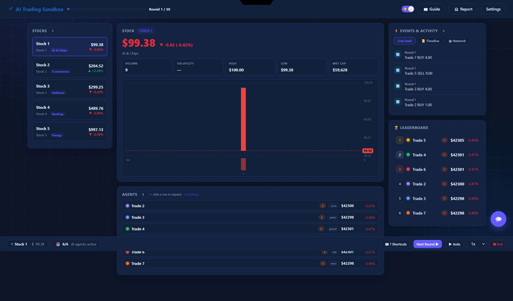

<div align="center">


# AI Trading Sandbox

A multi-agent stock market sandbox where autonomous LLM traders with distinct personalities, memories, and social relationships interact in a synthetic economy—creating a controlled environment for studying emergent behavior.


</div>

<p align="center">
  
</p>

> [!WARNING]
> Simulation for studying AI behavior — **not a trading system, not financial advice**.

## Table of Contents

- [What is this?](#what-is-this)
- [Features](#features)
- [The Traders](#the-traders)
- [How a Simulation Works](#how-a-simulation-works)
- [Emergent Behavior](#emergent-behavior)
- [Quick Start](#quick-start)
  - [CLI](#cli)
  - [Keyboard shortcuts (web)](#keyboard-shortcuts-web)
- [Configuration](#configuration)
- [Personality Presets](#personality-presets)
- [As a Library](#as-a-library)
- [API Reference](#api-reference)
- [Project Structure](#project-structure)
- [Contributing](#contributing)
- [License](#license)

## What is this?

Imagine putting different AI traders into the same artificial stock market, 
and let them compete, adapt, and shape the market on their own.

Each trader has its own personality, memory, portfolio, and relationships with
other traders. They all observe and trade in the same market, but can make completely
different decisions.

As traders buy and sell, they change the market itself. Events affect the
traders, traders affect prices, and those new prices influence the next round
of decisions.

The result is a controllable environment for exploring how complex behavior
can emerge from interactions between autonomous AI agents.

## Features

- **LLM traders** — Multiple LLM-powered traders compete in this market.
  A hardened prompt plus JSON structured-output mode (with automatic fallback)
  keeps every decision a valid `{"decisions": [...], ...}` object.
- **Multiple stocks** — configure any number of stocks, each with its own price,
  order book, **sector tag, and company blurb** fed to the agents' prompts.
- **Synthetic history** — each stock gets a seed-reproducible random walk
  pre-history so agents analyze real trends from the very first round.
- **Personality traits** — panic, greed, FOMO, stubbornness, loss aversion,
  overconfidence, regret avoidance; individually or as presets.
- **Human player** — join as a trader or spectate; trade from the web dashboard.
- **Market events** — 41 templates across 10 categories (global events hit every
  stock; company-specific ones hit one).
- **Agent memory** — short-term decision summaries plus long-term memory of key events.
- **Learning feedback** — each agent sees its last round's fills and their
  price moves since execution to learn from its own outcomes.
- **Grading** — every agent gets a blended 0-100 score + S/A/B/C/D grade from
  return, Sharpe, drawdown, and win rate.
- **Social influence** — idol/friends/enemies relationships drive herding and fading.
- **God Mode** — inject events and tune market parameters live.
- **Replay & reports** — per-round snapshots, event timeline replay, agent decision
  logs, one-click self-contained HTML report with shareable link.

## The Traders

Each trader has

- Personality
    - greed
    - panic
    - FOMO
    - stubbornness
    - loss aversion
    - overconfidence
    - regret avoidance

- Memory

    - recent decisions
    - important past events
    - previous outcomes

- Portfolio

    - cash
    - holdings
    - realized/unrealized performance

- Social relationships

    - idols
    - friends
    - enemies

- Market perception

    - current prices
    - trends
    - events
    - available information
 
Two traders can receive the same market information and still make completely different decisions.

## How a Simulation Works

Each round follows the same cycle:

```text
Market State
     ↓
Agent Observations
     ↓
Personality + Memory + Social Relationships
     ↓
AI Decisions
     ↓
Orders & Trades
     ↓
Price / Portfolio Updates
     ↓
Feedback & Memory
     ↓
Next Round
```

## Emergent Behavior

The sandbox does not just tell each agent what to do. Instead,
interesting behaviors can emerge from interactions between agents and the market.

Examples include:

- **Herding** — traders converge on the same decision.
- **Panic selling** — negative events trigger waves of selling.
- **FOMO** — rising prices attract increasingly aggressive buyers.
- **Contrarian behavior** — traders move against the crowd.
- **Social cascades** — one trader's behavior influences others.
- **Overreaction** — agents respond disproportionately to new information.
- **Behavioral persistence** — previous experiences affect future decisions.

These behaviors are to be explored.


## Quick Start

```bash
pip install -r requirements.txt
python run.py
```

Open http://localhost:5000, click **Configure API connections** to add at least
one trader API key, optionally configure stocks, then launch.

### CLI

```bash
python run.py --cli                                  # interactive round-by-round run
python run.py --cli --provider groq --model groq/compound-mini --api-key sk-...
python -m ai_trading_society                         # equivalent to --cli
```

The CLI reads the same `user_config.json` saved by the web homepage. Each round
pauses with a menu: continue, player trade, inject events, tune parameters,
show social relations, help, stop.

### Keyboard shortcuts (web)

`Space` next round · `A` auto-play · `S` end · `C` chat · `N` social graph ·
`E` export report · `?` shortcuts · `Esc` close

## Configuration

Saved to `user_config.json`, shared by the web UI and CLI:

| Key | Meaning |
| --- | --- |
| `traders` | Per-trader provider / model / API key / personality. |
| `stocks` | `{name, price, hold, sector?, blurb?}` list — multiple stocks supported. |
| `cash`, `hold`, `fee`, `slip` | Starting capital and transaction costs. |
| `social_influence` | Strength of herding behavior (0–1). |
| `player_participates` | Whether you join the market as a trader (default true). |
| `parallel_agents` | Concurrent per-round agent actions (default true). |

In `MarketConfig`, the synthetic pre-history length is `history_backfill_steps`
(default 30; set 0 to disable). Stock `sector`/`blurb` strings go straight into
each agent's observation and prompt. Set `parallel_agents=False` to collect
agent decisions strictly one-by-one.

## Personality Presets

`balanced` · `aggressive` · `conservative` · `panicky` · `greedy` ·
`fomo_driven` · `stubborn` · `emotional` — assigned per trader in the web UI,
or via `create_personality_agent(base_agent, personality=...)`.

## As a Library

```python
from ai_trading_society import (
    MarketConfig, StockSpec, MarketEnv, Simulator,
    build_agent_roster,
)

config = MarketConfig(
    stocks=[
        StockSpec(name="TechTitan", initial_price=150.0, sector="AI chips",
                  blurb="High-growth chip designer"),
        StockSpec(name="MegaBank", initial_price=250.0, sector="Banking",
                  blurb="Defensive large-cap bank"),
    ],
    fee_rate=0.001, slippage_rate=0.001, history_backfill_steps=30, seed=42,
)
agents, player = build_agent_roster(provider="openai", model="gpt-4o",
                                    api_key="sk-...", stocks=config.stocks)
env = MarketEnv(config, agents)
sim = Simulator(env)
sim.run(steps=30)
sim.report()                      # rankings, Sharpe, drawdown
sim.export_csv("trades.csv")
```

Every run saves a snapshot (metadata, config, state history) to `runs/<run_id>/`;
reload one with `load_run_snapshot()`.

## API Reference

| Symbol | Description |
| --- | --- |
| `MarketConfig(...)` | Market parameters: fees, slippage, events, social influence, seed. |
| `StockSpec(name, initial_price, initial_holdings, sector="", blurb="")` | One stock; optional sector tag & company blurb. |
| `MarketEnv(config, agents, seed=None)` | Engine: observations, matching, pricing, player buffer, last-round feedback. |
| `Simulator(env)` / `.run(steps, interactive=False)` | Run loop; returns state history. |
| `.report()` / `.export_csv(filepath)` | Final report / trade CSV. |
| `build_agent_roster(..., include_player=True)` | Build `(agents, player_agent)`. |
| `ExternalAIAgent(agent_id, api_provider, model, api_key)` | LLM-backed trader with short/long-term memory. |
| `TraitAgent(base_agent, panic=0, greed=0, ...)` | Personality wrapper. |
| `create_personality_agent(base, personality="balanced")` | Named preset. |
| `PlayerAgent(agent_id, cash, holdings)` | Human trader (absent when spectating). |
| `EventManager` / `EVENT_TEMPLATES` | 41 event templates across 10 categories. |
| `load_run_snapshot(run_id)` | Reload a saved run. |
| `evaluate_wealth_curve(wealths)` | Sharpe / max-drawdown / volatility / win-rate from a wealth curve. |
| `grade_performance(ret, sharpe, drawdown, win_rate)` | Blend into a 0-100 score + S/A/B/C/D grade. |
| `grade_wealth_curve(wealths, initial_wealth)` | Metrics + score + grade in one call. |

## Project Structure

```
run.py                    # Web dashboard / CLI entry point
ai_trading_society/
├── market_env.py         # Engine: observations, matching, pricing
├── market_events.py      # Event system (41 templates)
├── simulator.py          # Run loop, reporting, performance grading, CSV export
├── web/app.py            # Flask dashboard API
├── agents/
│   ├── external_ai_agent.py   # LLM trader (multi-provider, memory)
│   ├── traits.py              # Personality wrapper
│   ├── player_agent.py        # Human player
│   └── roster.py              # Roster factory + social map
└── ...
templates/                # Web UI pages
docs/user_facing_text.md  # All user-visible copy (editable)
```

## Contributing

Contributions are welcome! Please read [CONTRIBUTING.md](CONTRIBUTING.md) for
the development setup, code quality gates (ruff / mypy / pytest), and commit
message conventions. By participating you agree to abide by our
[Code of Conduct](CODE_OF_CONDUCT.md). Security vulnerabilities are handled
privately — see [SECURITY.md](SECURITY.md).

## License

MIT License. See [LICENSE](./LICENSE).

