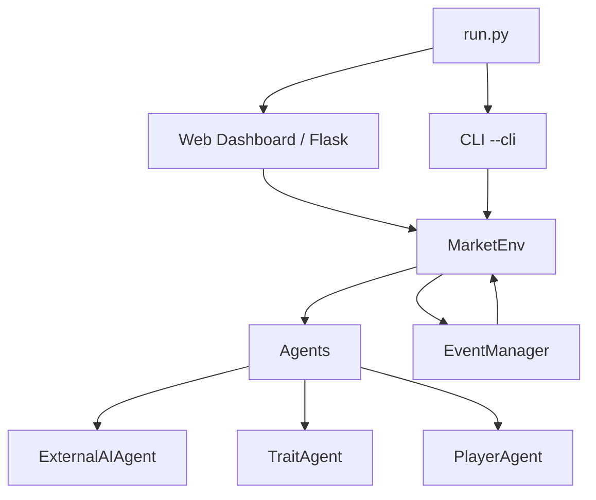

<div align="center">

# AI Trading Society

A multi-agent stock market sandbox where AI traders with distinct personalities
buy and sell a single stock while market events fire — and a human player can
step in and trade alongside them.


</div>

## Table of Contents

- [Introduction](#introduction)
- [Features](#features)
- [Architecture](#architecture)
- [Quick Start](#quick-start)
- [Installation](#installation)
- [Using External AI APIs](#using-external-ai-apis)
- [Configuration](#configuration)
- [Personality Traits](#personality-traits)
- [As a Library](#as-a-library)
- [Visualization](#visualization-optional)
- [Run Snapshots](#run-snapshots)
- [API Reference](#api-reference)
- [Project Structure](#project-structure)
- [Contributing](#contributing)
- [Roadmap](#roadmap)
- [License](#license)

## Introduction

AI Trading Society is a sandbox for studying how different AI decision makers
behave in a market-like environment. Several LLM-backed traders buy and sell one
stock, personality traits bend their decisions, market events shake sentiment,
and order matching moves the price with fees and slippage.

> [!WARNING]
> This is a simulation for studying AI behavior — **not a trading system, and
> not financial advice**. No real money, no real markets.

## Features

- **LLM traders** — real AI agents backed by OpenAI, Anthropic, Google Gemini,
  or any OpenAI-compatible endpoint (OpenRouter, Groq, ChatAnywhere, ...).
- **Personality traits** — panic selling, greed, FOMO, stubbornness, loss
  aversion, overconfidence, and regret avoidance, individually or as presets.
- **Human player** — trade yourself through the web dashboard or CLI, or just watch.
- **Market events** — 28 event templates across 7 categories (earnings,
  analyst, macro, social, regulatory, black swans, technical) that shift price
  and sentiment.
- **Order matching** — buy and sell orders matched proportionally; price moves
  with net buying pressure, with mean reversion, fees, and slippage.
- **God Mode** — inject events and tune market parameters live from the web or CLI.
- **Reproducible runs** — seeded randomness and run snapshots saved to disk.
- **Zero-dependency core** — the simulation engine runs on the Python standard
  library alone.

## Architecture

<!-- Experimental: if rendering fails, preview on GitHub -->


## Quick Start

### Web dashboard (recommended)

```bash
pip install -r requirements.txt
python run.py
```

Open http://localhost:5000, configure your traders on the homepage, then run
the simulation step by step. The dashboard includes God Mode (inject events,
tune market parameters) and a chat panel for talking to each agent in
character.

### CLI

```bash
python run.py --cli                     # interactive round-by-round terminal run
python run.py --cli --provider groq --model groq/compound-mini
python run.py --cli --api-key sk-...
python -m ai_trading_society
```

The terminal shows a progress bar, price sparkline, buy/sell pressure, live
events, and each agent's decision and reasoning every round.

In interactive mode the CLI pauses after each round with a command menu that
keeps it in sync with the web dashboard:

| Command | Action |
| --- | --- |
| `Enter` | advance to the next round |
| `b` / `buy` | buy shares as the human player |
| `s` / `sell` | sell shares as the human player |
| `e` / `event` | inject a market event (God Mode) |
| `p` / `params` | adjust market parameters live (God Mode) |
| `r` / `relations` | view each agent's social ties and traits |
| `h` / `help` | show the command list |
| `q` / `quit` | stop and show final results |

## Installation

```bash
# Web dashboard + Flask (matches the quick start above)
pip install -r requirements.txt
```

<details>
<summary>Detailed install steps & optional extras</summary>

1. Clone the repository.
2. (Recommended) Create a virtual environment.
3. Install dependencies:

    ```bash
    pip install -r requirements.txt
    ```

4. For optional features, install extras from source:

    ```bash
    pip install -e ".[web]"   # Flask dashboard (python run.py)
    pip install -e ".[viz]"   # matplotlib charts
    pip install -e ".[ai]"    # OpenAI / Anthropic / Gemini SDKs
    pip install -e ".[dev]"   # pytest, ruff, mypy

    # Everything
    pip install -e ".[all]"
    ```

    The core simulation engine has no third-party dependencies — only the
    extras above add them.

</details>

## Using External AI APIs

API keys are **never** read from environment variables or a `.env` file — they
always come from your configuration, never the environment.

> [!IMPORTANT]
> All secret values in the examples are placeholders. Never commit real API
> keys — e.g. `sk-...` or `nvapi-...` — to the repository.

Configure each trader on the homepage under **Configure Traders** (provider,
model, API key, optional base URL), or pass `api_key` explicitly in code:

```python
from ai_trading_society.agents import ExternalAIAgent

agent = ExternalAIAgent(
    agent_id="GPT_Trader",
    api_provider="openai",   # openai / anthropic / google / openrouter / groq / ...
    model="gpt-4o",
    api_key="sk-...",        # always passed explicitly
)
```

Supported providers: OpenAI, Anthropic, Google Gemini (native SDKs) plus any
OpenAI-compatible endpoint (OpenRouter, Groq, ChatAnywhere, ...) via
`base_url`.

## Configuration

`MarketConfig` (in `ai_trading_society/config.py`) controls the market:

| Field | Default | Meaning |
| --- | --- | --- |
| `initial_price` | 100.0 | Starting stock price |
| `price_sensitivity` | 0.02 | How strongly net buying pressure moves price |
| `max_price_change_ratio` | 0.10 | Max single-step price move |
| `fee_rate` / `slippage_rate` | 0.0 | Per-trade costs |
| `price_history_length` | 20 | Prices each agent can see |
| `event_probability_multiplier` | 1.5 | Event frequency scale (0 disables events) |
| `seed` | None | Random seed for reproducible runs |

The web homepage and CLI share one config file (`user_config.json`), so a
simulation configured in the browser runs identically from the terminal.

## Personality Traits

Wrap any agent with a personality, or use a preset:

```python
from ai_trading_society.agents import TraitAgent, create_personality_agent

agent = TraitAgent(
    base_agent,
    panic=0.7,          # panic-sell on big drawdowns
    greed=0.6,          # hold winners too long
    fomo=0.5,           # chase strong momentum
    stubbornness=0.4,   # repeat the previous action
    loss_aversion=0.3,  # cut losses fast
)

agent = create_personality_agent(base_agent, personality="greedy")
# presets: balanced, aggressive, conservative, panicky, greedy,
#          fomo_driven, stubborn, emotional
```

## As a Library

```python
from ai_trading_society import MarketConfig, MarketEnv, Simulator
from ai_trading_society.agents import build_agent_roster

config = MarketConfig(
    initial_price=100.0,
    fee_rate=0.001,
    slippage_rate=0.001,
    seed=42,
)
agents, player = build_agent_roster(
    provider="openai", model="gpt-4o", api_key="sk-...",
    cash=10000, holdings=20,
)

env = MarketEnv(config, agents, seed=config.seed)
sim = Simulator(env)
sim.run(steps=25)
sim.report(generate_charts=True)
```

## Visualization (optional)

```bash
pip install -e ".[viz]"
```

```python
from ai_trading_society import generate_all_charts

generate_all_charts(
    price_history=env.price_history,
    state_history=sim.state_history,
    event_history=env.event_manager.event_history,
    initial_price=env.config.initial_price,
    output_dir="./charts",
)
```

Or simply `sim.report(generate_charts=True)`.

## Run Snapshots

Every `Simulator.run()` seeds randomness and saves a snapshot (metadata, config,
state history, trade history) to `runs/<run_id>/`, so results are reproducible
and reviewable after the fact. Use `load_run_snapshot()` to reload one.

## API Reference

| Symbol | Description |
| --- | --- |
| `MarketConfig(...)` | Market parameters: price, fees, slippage, events, seed. |
| `MarketEnv(config, agents, seed=None)` | Market engine: observations, order matching, pricing. |
| `Simulator(env)` | Simulation controller. |
| `Simulator.run(steps, ..., interactive=False, seed=None)` | Run N steps, optionally interactively. Returns `state_history`. |
| `Simulator.report(generate_charts=False)` | Print final report (rankings, Sharpe, drawdown). |
| `Simulator.export_csv(filepath)` | Export trade history to CSV. |
| `build_agent_roster(provider, model, api_key, trader_configs=None, cash=10000, holdings=20)` | Build `(agents, player_agent)` roster. |
| `ExternalAIAgent(agent_id, api_provider, model, api_key, base_url=None)` | LLM-backed trader. |
| `TraitAgent(base_agent, panic=0, greed=0, fomo=0, stubbornness=0, loss_aversion=0, overconfidence=0, regret_avoidance=0)` | Personality wrapper around any agent. |
| `create_personality_agent(base_agent, personality="balanced")` | Apply a named preset. |
| `PlayerAgent(agent_id, cash, holdings)` | The human player, always present. |
| `EventManager` / `MarketEvent` / `EVENT_TEMPLATES` | Event system and its 28 templates. |
| `generate_all_charts(price_history, state_history, event_history, initial_price, output_dir, initial_wealths=None)` | Optional matplotlib charts. |
| `load_run_snapshot(run_id)` / `save_run_snapshot(...)` / `set_seed(seed)` | Run snapshots and reproducibility helpers. |

## Project Structure

```
ai_trading_society/
├── __init__.py          # Public API
├── __main__.py          # CLI entry point
├── config.py            # MarketConfig
├── config_store.py      # Shared user_config.json (web + CLI)
├── base_agent.py        # Agent interface
├── market_env.py        # Market engine: observations, matching, pricing
├── market_events.py     # Event system (28 templates)
├── simulator.py         # Run loop, reporting, CSV export
├── run_metadata.py      # Seed handling and run snapshots
├── visualization.py     # Optional charts
├── console_utils.py     # Terminal output helpers
├── web/
│   └── app.py           # Flask dashboard
└── agents/
    ├── external_ai_agent.py   # LLM trader (multi-provider)
    ├── traits.py              # Personality wrapper
    ├── player_agent.py        # Human player
    └── roster.py              # Roster factory

run.py                    # Web dashboard / CLI entry point
templates/                # Web UI pages
```

## Contributing

- [ ] Fork the repository
- [ ] Create a feature branch
- [ ] Open a pull request

Code style is enforced by `ruff` (`[tool.ruff]` in `pyproject.toml`); run
`pytest` before submitting.

## Roadmap

- [x] Core market engine (matching, pricing, fees, slippage)
- [x] LLM traders across multiple providers
- [x] Personality trait system
- [x] Web dashboard with God Mode and chat
- [ ] More event categories and scenarios
- [ ] Portfolio / multiple stocks support
- [ ] Agent-to-agent social dynamics expansion

## License

MIT License. See [LICENSE](./LICENSE).
